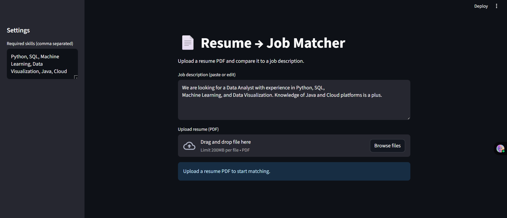
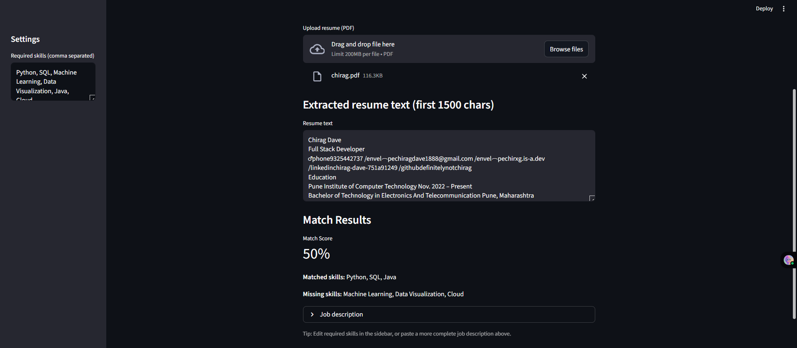

# Resume Matcher

A simple Resume Matcher app that compares resumes with job descriptions using Python and Streamlit.

## 🚀 Features
- Upload a resume PDF
- Extract keywords (Python, ML, SQL, Java, etc.)
- Compare against a job description
- Show match % score
- Display missing skills

## 🛠️ Technologies Used
- Python
- Streamlit
- PyPDF2

## 📸 Screenshots

### Home Page

### Result Page

